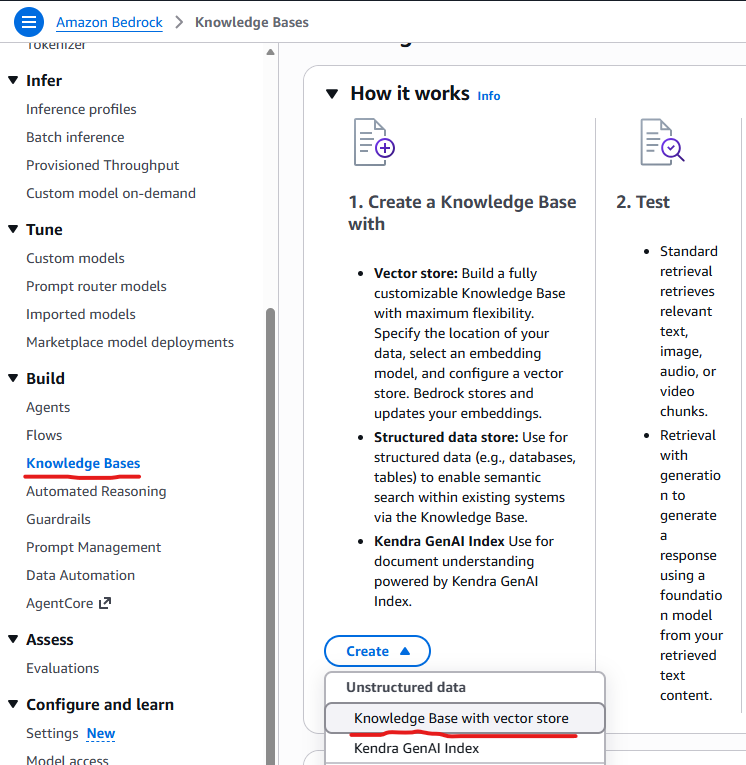
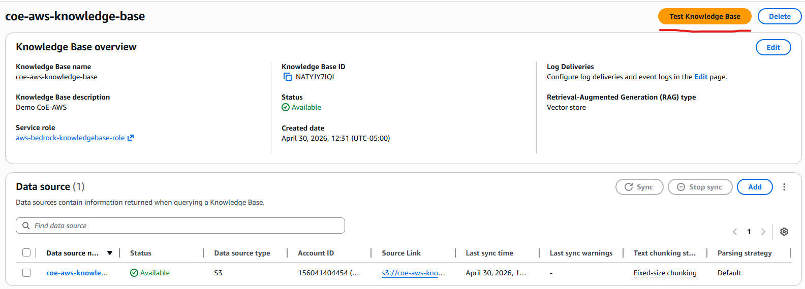
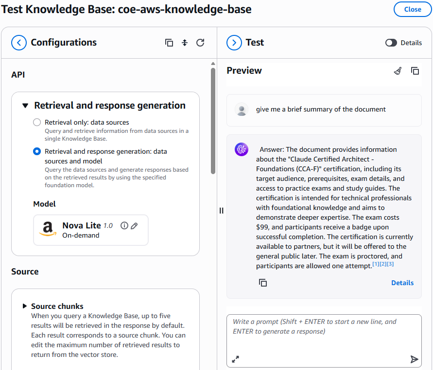

# Building Cost-Effective RAG Applications with Amazon Bedrock Knowledge Bases and Amazon S3 Vectors

In this course, you will learn how to build cost-effective Retrieval Augmented Generation (RAG) applications using Amazon Bedrock Knowledge Bases and Amazon S3 Vectors. You'll discover how to reduce vector storage costs by up to 90% while maintaining subsecond query performance for large-scale knowledge bases.

This course will guide you through the complete process of integrating Amazon S3 Vectors with Amazon Bedrock Knowledge Bases, from initial setup to testing and deployment. You'll gain hands-on experience with cost-optimized vector storage solutions that scale to handle millions of documents.

By the end of this course, you will be able to:

• Configure Amazon Bedrock Knowledge Bases with Amazon S3 Vectors as the vector store

• Implement cost-effective RAG applications with subsecond query performance

• Apply best practices for metadata configuration and security in vector storage implementations

This course is based on the AWS blog post 'Building cost-effective RAG applications with Amazon Bedrock Knowledge Bases and Amazon S3 Vectors' published on July 17, 2025, by Vaibhav Sabharwal, Ashish Lal, Dani Mitchell, and Irene Marban. The original blog post can be found at: https://aws.amazon.com/blogs/machine-learning/building-cost-effective-rag-applications-with-amazon-bedrock-knowledge-bases-and-amazon-s3-vectors


## Course Overview

### Understanding Vector Embedding Challenges and Solutions

**The Cost Challenge of Vector Embeddings**
Vector embeddings are essential for modern RAG applications, but organizations face significant cost challenges as they scale. Let's explore these challenges and understand how Amazon S3 Vectors provides a solution.

As knowledge bases grow and require more granular embeddings, many vector databases that rely on high-performance storage such as SSDs or in-memory solutions become prohibitively expensive.

This cost barrier often forces organizations to limit the scope of their RAG applications or compromise on the granularity of their vector representations, potentially impacting the quality of results.

Additionally, for use cases involving historical or archival data that still needs to remain searchable, storing vectors in specialized vector databases optimized for high throughput workloads represents an unnecessary ongoing expense.

**Amazon S3 Vectors: A Cost-Effective Solution**
Starting July 15, Amazon Bedrock Knowledge Bases customers can select Amazon S3 Vectors as their vector store, offering significant cost savings while maintaining performance.

Amazon S3 Vectors (preview) is the first cloud object storage with built-in support to store and query vectors at a low cost.

---

### Understanding the Integration Architecture

**Integration Architecture Overview**
Let's explore how the Amazon Bedrock Knowledge Bases and S3 Vectors integration works and its key benefits.

This integration allows you to build scalable RAG applications without provisioning or managing complex infrastructure, delivering the cost savings and performance benefits outlined in the previous module.

The solution is ideal for working with larger vector datasets generated from massive volumes of unstructured data including text, images, audio, and video.

The pay-as-you-go pricing model provides industry-leading cost optimization for vector operations.

**Advanced Search Capabilities and Use Cases**
Amazon S3 Vectors provides advanced search capabilities and is ideal for specific organizational needs. Let's explore these features and use cases.

Advanced search capabilities include rich metadata filtering, so you can refine queries by document attributes such as dates, categories, and sources.

**High-Level Walkthrough Steps**
The integration process follows a structured approach with five main steps. Let's review the high-level process you'll follow in this course.

The walkthrough follows these high-level steps:

1. Create a new knowledge base
Set up your Amazon Bedrock Knowledge Base with the appropriate configuration and permissions.

2. Configure the data source
Specify where your documents are stored and configure access permissions.

3. Configure data source and processing
Set up parsing strategies, chunking configurations, and embedding models.

4. Sync the data source
Process your documents and generate vector embeddings for storage in S3 Vectors.

5. Test the knowledge base
Validate functionality using both retrieval-only and retrieval-with-generation modes.

---

### Prerequisites and Requirements

**What You Need Before Getting Started**
Before you begin building your cost-effective RAG application, ensure you have the necessary AWS resources and permissions configured.

Before you get started, make sure that you have the following prerequisites:

- AWS Account
  An AWS Account with appropriate service access to Amazon Bedrock, Amazon Simple Storage Service (Amazon S3), and related services.

- IAM Permissions
  An AWS Identity and Access Management (IAM) role with the appropriate permissions to access Amazon Bedrock and Amazon S3.

- Model Access
  Enable model access for embedding and inference models such as Amazon Titan Text Embeddings V2 and Amazon Nova Pro.

Ensure you have enabled model access in Amazon Bedrock for the embedding and inference models you plan to use, as this is required before creating your knowledge base.

---

### Setting Up Your Knowledge Base

**Creating a New Knowledge Base**
Let's walk through the step-by-step process of creating a knowledge base with Amazon S3 Vectors using the AWS Management Console.

To create a new knowledge base, follow these steps:

0. Create an S3 bucket before using on Bedrock:

<video controls src="./media/20260430-1646-08.2142818.mp4" title="Title"></video>

1. On the Amazon Bedrock console in the left navigation pane, choose Knowledge Bases. To initiate the creation process, in the Create dropdown list, choose Knowledge Base with vector store.



2. On the Provide Knowledge Base details page, enter a descriptive name for your knowledge base and an optional description to identify its purpose. Select your IAM permissions approach—either create a new service role or use an existing one—to grant the necessary permissions for accessing AWS services.

<video controls src="./media/20260430-1640-40.7129958.mp4" title="Title"></video>

3. Choose Amazon S3. Optionally, add tags to help organize and categorize your resources and configure log delivery destinations such as an Amazon S3 bucket or Amazon CloudWatch for monitoring and troubleshooting.

4. Choose Next to proceed to the data source configuration.

**Configuring the Data Source**

The data source configuration determines where your documents are stored and how they will be processed. Let's configure this step by step.

To configure the data source:

1. Assign a descriptive name to your knowledge base data.

2. In Data source location, select whether the S3 bucket exists in your current AWS account or another account, then specify the location where your documents are stored.

<video controls src="./media/20260430-1706-38.9865470.mp4" title="Title"></video>

   Configure your parsing strategy to determine how Amazon Bedrock processes your documents. Select Amazon Bedrock default parser for text-only documents at no additional cost. Select Amazon Bedrock Data Automation as parser or Foundation models as a parser for processing complex documents with visual elements.

   The chunking strategy configuration is equally critical because it defines how your content is segmented into meaningful units for vector embedding, directly impacting retrieval quality and context preservation. We have selected Fixed-size chunking for this example due to its predictable token sizing and simplicity.

   Because both parsing and chunking decisions can't be modified after creation, select options that best match your content structure and retrieval needs.

   For sensitive data, you can use advanced settings to implement AWS Key Management Service (AWS KMS) encryption or apply custom transformation functions to optimize your documents before ingestion. By default, Amazon S3 Vectors will use server-side encryption (SSE-S3).

**Configuring Data Storage and Processing**

The embeddings model and vector store configuration are crucial for your knowledge base performance. Let's configure these components properly.

To configure data storage and processing, first select the embeddings model. The embeddings model will transform your text chunks into numerical vector representations for semantic search capabilities.


If connecting to an existing Amazon S3 Vector as a vector store, make sure the embedding model dimensions match those used when creating your vector store because dimensional mismatches will cause ingestion failures.

Amazon Bedrock offers several embeddings models to choose from, each with different vector dimensions and performance characteristics optimized for various use cases. Consider both the semantic richness of the model and its cost implications when making your selection.

---

### Vector Store Configuration Options

**Choosing Your Vector Store Configuration**
For vector storage selection, you have two main options for how Amazon Bedrock Knowledge Bases will store and manage the vector embeddings generated from your documents in Amazon S3 Vectors.

Next, configure the vector store. Choose how Amazon Bedrock Knowledge Bases will store and manage the vector embeddings using one of the following two options:

- quick create a new vector store
- use an existing vector store

**Quick Create New Vector Store**
The quick create option is the recommended approach for most users, automatically handling the S3 vector bucket and index creation.

This recommended option automatically creates an S3 vector bucket in your account during knowledge base creation. The system optimizes your vector storage for cost-effective, durable storage of large-scale vector datasets.

<video controls src="./media/20260430-1727-54.7868990.mp4" title="Title"></video>


**Using an Existing Vector Store**
If you already have an S3 Vector bucket and index configured, you can connect your knowledge base to the existing infrastructure.

When creating your Amazon S3 Vector as a vector store index for use with Amazon Bedrock Knowledge Bases, you can attach metadata (such as, year, author, genre, and location) as key-value pairs to each vector.

By default, metadata fields can be used as filters in similarity queries unless specified as nonfilterable metadata at the time of vector index creation.

Amazon S3 Vector indexes support string, number, and Boolean types up to 40 KB per vector, with filterable metadata capped at 2 KB per vector.

To accommodate larger text chunks and richer metadata while still allowing filtering on other important attributes, add "AMAZON_BEDROCK_TEXT" to the nonFilterableMetadataKeys list in your index configuration. This approach optimizes your storage allocation for document content while preserving filtering capabilities for meaningful attributes like categories or dates.

Here's an example for creating an Amazon S3 Vector index with proper metadata configuration:

```
s3vectors.create_index(
    vectorBucketName="my-first-vector-bucket",
    indexName="my-first-vector-index",
    dimension=1024,
    distanceMetric="cosine",
    dataType="float32",  
    metadataConfiguration={"nonFilterableMetadataKeys": ["AMAZON_BEDROCK_TEXT"]} 
)
```

After you have an S3 Vector bucket and index, you can connect it to your knowledge base. You'll need to provide both the S3 Vector bucket Amazon Resource Name (ARN) and vector index ARN to correctly link your knowledge base to your existing S3 Vector index.

<video controls src="./media/20260430-1730-25.1912247.mp4" title="Title"></video>

---

### Synchronizing Your Data Source

**Syncing Data Source to Generate Vector Embeddings**
After configuring your knowledge base with S3 Vectors, you need to synchronize your data source to generate and store vector embeddings.

From the Amazon Bedrock Knowledge Bases console, open your created knowledge base and locate your configured data source and choose Sync to initiate the process.


During synchronization, the system processes your documents according to your parsing and chunking configurations, generates embeddings using your selected model, and stores them in your Amazon S3 vector index.

You can monitor the synchronization progress in real time if you've configured Amazon CloudWatch Logs and verify completion status before testing your knowledge base's retrieval capabilities.

**Testing Your Knowledge Base**
After successfully configuring your knowledge base with S3 Vectors, you can validate its functionality using the built-in testing interface.

You can use this interactive console to experiment with different query types and view both retrieval results and generated responses.

- Retrieval Only Mode
  Use the Retrieve API mode to examine raw source chunks and understand how your knowledge base processes queries.

- Retrieval and Response Generation
  Use the RetrieveandGenerate API to see how foundation models such as Amazon Nova use your retrieved content to generate responses.

The testing interface provides valuable insights into how your knowledge base processes queries, displaying source chunks, their relevance scores, and associated metadata.



**Configuring Query Settings and Optimization**

You can configure various query settings for your knowledge base to optimize retrieval quality and ensure appropriate responses.

You can also configure query settings for your knowledge base just as you would with other vector storage options.

- Metadata Filters
  Apply filters for metadata-based selection to refine search results based on document attributes like dates, categories, or sources.

- Guardrails
  Implement guardrails to ensure appropriate and safe responses from your knowledge base.

- Reranking Capabilities
  Use reranking to improve the relevance ordering of retrieved results.

- Query Modification
  Apply query modification options to optimize how user queries are processed and interpreted.

These tools help optimize retrieval quality and make sure the most relevant information is presented to your foundation models. Amazon S3 Vectors currently supports semantic search functionality.

Using this hands-on validation, you can refine your configuration before integrating the knowledge base with production applications.



---

### Programmatic Implementation

**Creating Knowledge Base Programmatically**
For those who prefer to automate the process or integrate it into existing workflows, you can create your knowledge base programmatically using the AWS SDK.

For those who prefer to automate this process or integrate it into existing workflows, you can also create your knowledge base programmatically using the AWS SDK.

Amazon Bedrock Knowledge Bases with S3 Vectors Repository
For those who prefer to configure their knowledge base programmatically rather than using the console, this GitHub repository provides a guided notebook that you can follow to deploy the setup in your own account.

For those who prefer to configure their knowledge base programmatically rather than using the console, this GitHub repository provides a guided notebook that you can follow to deploy the setup in your own account.

[GO TO GITHUB](https://github.com/aws-samples/amazon-bedrock-samples/blob/main/rag/knowledge-bases/features-examples/10-s3-vectors/knowledge-base-s3-vector.ipynb)

The following is a sample code showing how the API call looks when programmatically creating an Amazon Bedrock knowledge base with an existing Amazon S3 Vector index:

```
response = bedrock.create_knowledge_base(
    description='Amazon Bedrock Knowledge Base integrated with Amazon S3 Vectors',
    knowledgeBaseConfiguration={
        'type': 'VECTOR',
        'vectorKnowledgeBaseConfiguration': {
             'embeddingModelArn': f'arn:aws:bedrock:{region}::foundation-model/amazon.titan-embed-text-v2:0',
             'embeddingModelConfiguration': {
                 'bedrockEmbeddingModelConfiguration': {
                     'dimensions': vector_dimension, #Verify this is the same value as S3 vector index configuration
                     'embeddingDataType': 'FLOAT32'
                 }
             },
        },
    },
     name=knowledge_base_name,
     roleArn=roleArn,
     storageConfiguration={
         's3VectorsConfiguration': {
             'indexArn': vector_index_arn
         },
         'type': 'S3_VECTORS'
     }
)
```

**Required IAM Permissions and Policies**

The role attached to the knowledge base requires several policies to access S3 Vectors API, embedding models, and data sources.

The role attached to the knowledge base should have several policies attached to it, including access to the Amazon S3 Vectors API, the models used for embedding, generation, and reranking (if used), and the Amazon S3 bucket used as data source.

If you're using a customer managed key for your Amazon S3 Vector as a vector store, you'll need to provide an additional policy to allow the decryption of the data.

The following is the policy needed to access the Amazon S3 Vector as a vector store:

```json
{
    "Version": "2012-10-17",
    "Statement": [
        {
            "Sid": "BedrockInvokeModelPermission",
            "Effect": "Allow",
            "Action": [
                "bedrock:InvokeModel"
            ],
            "Resource": [
                "arn:aws:bedrock:{REGION}::foundation-model/amazon.titan-embed-text-v2:0"
            ]
        },
        {
            "Sid": "KmsPermission",
            "Effect": "Allow",
            "Action": [
                "kms:GenerateDataKey",
                "kms:Decrypt"
            ],
            "Resource": [
                "arn:aws:kms:{REGION}:{ACCOUNT_ID}:key/{KMS_KEY_ID}"
            ]
        },
        {
            "Sid": "S3ListBucketPermission",
            "Effect": "Allow",
            "Action": [
                "s3:ListBucket"
            ],
            "Resource": [
                "arn:aws:s3:::{SOURCE_BUCKET_NAME}"
            ],
            "Condition": {
                "StringEquals": {
                    "aws:ResourceAccount": [
                        "{ACCOUNT_ID}"
                    ]
                }
            }
        },
        {
            "Sid": "S3GetObjectPermission",
            "Effect": "Allow",
            "Action": [
                "s3:GetObject"
            ],
            "Resource": [
                "arn:aws:s3:::{SOURCE_BUCKET_NAME}/{PREFIX}/*"
            ],
            "Condition": {
                "StringEquals": {
                    "aws:ResourceAccount": [
                        "{ACCOUNT_ID}"
                    ]
                }
            }
        },
        {
            "Sid": "S3VectorsAccessPermission",
            "Effect": "Allow",
            "Action": [
                "s3vectors:GetIndex",
                "s3vectors:QueryVectors",
                "s3vectors:PutVectors",
                "s3vectors:GetVectors",
                "s3vectors:DeleteVectors"
            ],
            "Resource": "arn:aws:s3vectors:{REGION}:{ACCOUNT_ID}:bucket/{VECTOR_BUCKET_NAME}/index/{VECTOR_INDEX_NAME}",
            "Condition": {
                "StringEquals": {
                    "aws:ResourceAccount": "{ACCOUNT_ID}"
                }
            }
        }
    ]
}
```

---

### Resource Cleanup and Management

**Cleaning Up Your Resources**

To avoid ongoing charges and maintain good resource hygiene, it's important to properly clean up resources when they're no longer needed.

To clean up your resources, complete the following steps. To delete the knowledge base:

1. On the Amazon Bedrock console, choose Knowledge Bases
2. Select your Knowledge Base and note both the IAM service role name and S3 Vector index ARN
3. Choose Delete and confirm

To delete the Amazon S3 Vector as a vector store, use the following AWS Command Line Interface (AWS CLI) commands:

```
aws s3vectors delete-index --vector-bucket-name YOUR_VECTOR_BUCKET_NAME --index-name YOUR_INDEX_NAME --region YOUR_REGION
aws s3vectors delete-vector-bucket --vector-bucket-name YOUR_VECTOR_BUCKET_NAME --region YOUR_REGION
```

1. On the IAM console, find the role noted earlier
2. Select and delete the role

To delete the sample dataset:

1. On the Amazon S3 console, find your S3 bucket
2. Select and delete the files you uploaded for this tutorial

**Conclusion and Best Practices**

The integration between Amazon Bedrock Knowledge Bases and Amazon S3 Vectors represents a significant advancement in making RAG applications more accessible and economically viable at scale.

By leveraging the cost-optimized storage capabilities outlined in this course, organizations can now build knowledge bases at scale with improved cost efficiency.

This means customers can strike an optimal balance between performance and economics, and you can focus on creating value through AI-powered applications rather than managing complex vector storage infrastructure.

- Using S3 Vectors with Amazon Bedrock Knowledge Bases
  To get started on Amazon Bedrock Knowledge Bases and Amazon S3 Vectors integration, refer to the Amazon S3 User Guide.
  
  [GO TO USER GUIDE](https://docs.aws.amazon.com/AmazonS3/latest/userguide/s3-vectors-bedrock-kb.html)

- Introducing Amazon S3 Vectors
  For details on how to create a vector store, refer to this comprehensive guide in the AWS News Blog.

  [GO TO AWS ](https://aws.amazon.com/blogs/aws/introducing-amazon-s3-vectors-first-cloud-storage-with-native-vector-support-at-scale/)