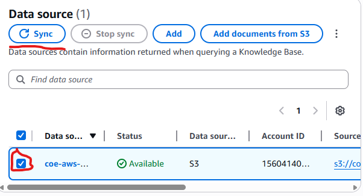

# Building Cost-Effective RAG Applications with Amazon Bedrock Knowledge Bases and Amazon S3 Vectors

- [Building Cost-Effective RAG Applications with Amazon Bedrock Knowledge Bases and Amazon S3 Vectors](#building-cost-effective-rag-applications-with-amazon-bedrock-knowledge-bases-and-amazon-s3-vectors)
  - [Prerequisites](#prerequisites)
  - [Step-by-Step Guide](#step-by-step-guide)
    - [Step 1 — Create an S3 Bucket for Your Documents](#step-1--create-an-s3-bucket-for-your-documents)
    - [Step 2 — Create the Knowledge Base in Amazon Bedrock](#step-2--create-the-knowledge-base-in-amazon-bedrock)
    - [Step 3 — Configure the Data Source](#step-3--configure-the-data-source)
    - [Step 4 — Configure the Embedding Model and Vector Store](#step-4--configure-the-embedding-model-and-vector-store)
    - [Step 5 — Sync the Data Source](#step-5--sync-the-data-source)
    - [Step 6 — Test the Knowledge Base](#step-6--test-the-knowledge-base)
  - [Optional: Programmatic Setup (AWS SDK)](#optional-programmatic-setup-aws-sdk)
  - [IAM Permissions Required](#iam-permissions-required)
  - [Cleaning Up Resources](#cleaning-up-resources)
  - [Additional Resources](#additional-resources)

---

**What is RAG?**
Retrieval Augmented Generation (RAG) is a technique that allows an AI model to answer questions based on your own documents — instead of only relying on its training data. This guide walks through how to set that up using **Amazon Bedrock Knowledge Bases** and **Amazon S3 Vectors** as a cost-effective vector store.

> 💡 **Who is this for?** Anyone with an AWS account who wants to build a searchable knowledge base from their own documents — no deep ML knowledge required.

---

## Prerequisites

Before starting, make sure the following are in place:

- **AWS Account** with access to Amazon Bedrock, Amazon S3, and related services.
- **IAM Role** with permissions to access both Bedrock and S3.
- **Model Access enabled** in Amazon Bedrock for:
  - Embedding model: `Amazon Titan Text Embeddings V2`
  - Inference model: `Amazon Nova Pro` (or similar)

> To enable model access, go to the **Amazon Bedrock Console → Model Access** and request access to the required models before proceeding.

---

## Step-by-Step Guide

### Step 1 — Create an S3 Bucket for Your Documents

Before creating the knowledge base, the user needs an S3 bucket where the source documents (PDFs, text files, etc.) will be stored.

1. Go to the **Amazon S3 Console**.
2. Click **Create bucket**, assign a name, and choose a region.
3. Upload the documents that will serve as the knowledge base source.

<video controls src="./20260430-1646-08.2142818.mp4" title="Title"></video>

---

### Step 2 — Create the Knowledge Base in Amazon Bedrock

1. Open the **Amazon Bedrock Console**.
2. In the left navigation panel, select **Knowledge Bases**.
3. Click the **Create** dropdown and choose **Knowledge Base with vector store**.


4. On the **Knowledge Base details** page:
   - Enter a descriptive **name** and optional **description**.
   - Under **IAM Permissions**, either create a new service role or use an existing one.
   - Choose **Amazon S3** as the data source type.
   - Optionally add tags and configure log delivery (CloudWatch or S3).

5. Click **Next**.

<video controls src="./20260430-1640-40.7129958.mp4" title="Title"></video>

---

### Step 3 — Configure the Data Source

This step tells Bedrock where the documents are and how to process them.

1. Assign a name to the data source.
2. Under **Data source location**, select whether the S3 bucket belongs to the current account or another, then enter the bucket path.

<video controls src="./20260430-1706-38.9865470.mp4" title="Title"></video>

3. Choose a **Parsing Strategy**:
   - `Amazon Bedrock default parser` — for plain text documents (free).
   - `Amazon Bedrock Data Automation` or `Foundation models` — for documents with images, tables, or visual content.

4. Choose a **Chunking Strategy**:
   - `Fixed-size chunking` is recommended for simplicity and predictable token sizing.

> ⚠️ **Important:** Parsing and chunking settings **cannot be changed after creation**. Choose carefully based on the type of content.

5. Optionally configure **KMS encryption** for sensitive data (by default, S3 Vectors uses SSE-S3 encryption).

---

### Step 4 — Configure the Embedding Model and Vector Store

This step defines how text is transformed into vectors and where those vectors are stored.

1. **Select an Embedding Model** — The model converts text chunks into numerical vector representations.
   - Recommended: `Amazon Titan Text Embeddings V2` (1024 dimensions).

> ⚠️ If connecting to an **existing** S3 Vector index, make sure the model dimensions match those used when the index was created. A mismatch will cause ingestion failures.

2. **Configure the Vector Store** — Choose one of two options:

   **Option A — Quick Create (Recommended)**
   Bedrock automatically creates a new S3 vector bucket and index. This is the simplest option for most users.

<video controls src="./20260430-1727-54.7868990.mp4" title="Title"></video>

   **Option B — Use an Existing Vector Store**
   If an S3 Vector bucket and index already exist, they can be connected here by providing the **S3 Vector bucket ARN** and **vector index ARN**.

   When using an existing index, it is recommended to add `AMAZON_BEDROCK_TEXT` to the `nonFilterableMetadataKeys` list. This optimizes storage for document content while keeping filters (like date or category) functional.

   Example index creation:
   ```python
   s3vectors.create_index(
       vectorBucketName="my-first-vector-bucket",
       indexName="my-first-vector-index",
       dimension=1024,
       distanceMetric="cosine",
       dataType="float32",
       metadataConfiguration={"nonFilterableMetadataKeys": ["AMAZON_BEDROCK_TEXT"]}
   )
```

<video controls src="./20260430-1730-25.1912247.mp4" title="Title"></video>

3. Click **Next**, review the configuration, and click **Create Knowledge Base**.

---

### Step 5 — Sync the Data Source

Once the knowledge base is created, the data source must be synchronized. This is what processes the documents and generates the vector embeddings.

1. Open the newly created Knowledge Base from the Bedrock console.
2. Find the configured data source and click **Sync**.



During sync, Bedrock will:
- Parse and chunk the documents.
- Generate embeddings using the selected model.
- Store the vectors in the S3 vector index.

> 💡 Enable **Amazon CloudWatch Logs** to monitor sync progress and troubleshoot errors in real time.

---

### Step 6 — Test the Knowledge Base

After syncing, the knowledge base can be tested directly from the Bedrock console.

1. Open the Knowledge Base and click **Test**.
2. Enter a question related to the uploaded documents.

Two testing modes are available:

| Mode | Description |
|------|-------------|
| **Retrieve Only** | Returns the raw document chunks most relevant to the query, along with relevance scores. |
| **Retrieve and Generate** | Uses a foundation model (e.g., Amazon Nova) to generate a full answer based on retrieved chunks. |


Additional query settings can be configured:
- **Metadata Filters** — Narrow results by document attributes (date, category, source).
- **Guardrails** — Ensure appropriate and safe responses.
- **Reranking** — Improve result relevance ordering.
- **Query Modification** — Adjust how user queries are interpreted.


---

## Optional: Programmatic Setup (AWS SDK)

For users who prefer to automate the setup, the knowledge base can be created using the AWS SDK (Python/Boto3). Below is a sample API call:

```python
response = bedrock.create_knowledge_base(
    description='Amazon Bedrock Knowledge Base integrated with Amazon S3 Vectors',
    knowledgeBaseConfiguration={
        'type': 'VECTOR',
        'vectorKnowledgeBaseConfiguration': {
            'embeddingModelArn': f'arn:aws:bedrock:{region}::foundation-model/amazon.titan-embed-text-v2:0',
            'embeddingModelConfiguration': {
                'bedrockEmbeddingModelConfiguration': {
                    'dimensions': 1024,  # Must match S3 vector index dimension
                    'embeddingDataType': 'FLOAT32'
                }
            },
        },
    },
    name=knowledge_base_name,
    roleArn=roleArn,
    storageConfiguration={
        's3VectorsConfiguration': {
            'indexArn': vector_index_arn
        },
        'type': 'S3_VECTORS'
    }
)
```

> 📓 A full guided notebook is available on GitHub:
> [amazon-bedrock-samples — S3 Vectors Knowledge Base Notebook](https://github.com/aws-samples/amazon-bedrock-samples/blob/main/rag/knowledge-bases/features-examples/10-s3-vectors/knowledge-base-s3-vector.ipynb)

---

## IAM Permissions Required

The IAM role attached to the knowledge base needs the following policy:

```json
{
    "Version": "2012-10-17",
    "Statement": [
        {
            "Sid": "BedrockInvokeModelPermission",
            "Effect": "Allow",
            "Action": [
                "bedrock:InvokeModel"
            ],
            "Resource": [
                "arn:aws:bedrock:{REGION}::foundation-model/amazon.titan-embed-text-v2:0"
            ]
        },
        {
            "Sid": "KmsPermission",
            "Effect": "Allow",
            "Action": [
                "kms:GenerateDataKey",
                "kms:Decrypt"
            ],
            "Resource": [
                "arn:aws:kms:{REGION}:{ACCOUNT_ID}:key/{KMS_KEY_ID}"
            ]
        },
        {
            "Sid": "S3ListBucketPermission",
            "Effect": "Allow",
            "Action": [
                "s3:ListBucket"
            ],
            "Resource": [
                "arn:aws:s3:::{SOURCE_BUCKET_NAME}"
            ],
            "Condition": {
                "StringEquals": {
                    "aws:ResourceAccount": [
                        "{ACCOUNT_ID}"
                    ]
                }
            }
        },
        {
            "Sid": "S3GetObjectPermission",
            "Effect": "Allow",
            "Action": [
                "s3:GetObject"
            ],
            "Resource": [
                "arn:aws:s3:::{SOURCE_BUCKET_NAME}/{PREFIX}/*"
            ],
            "Condition": {
                "StringEquals": {
                    "aws:ResourceAccount": [
                        "{ACCOUNT_ID}"
                    ]
                }
            }
        },
        {
            "Sid": "S3VectorsAccessPermission",
            "Effect": "Allow",
            "Action": [
                "s3vectors:GetIndex",
                "s3vectors:QueryVectors",
                "s3vectors:PutVectors",
                "s3vectors:GetVectors",
                "s3vectors:DeleteVectors"
            ],
            "Resource": "arn:aws:s3vectors:{REGION}:{ACCOUNT_ID}:bucket/{VECTOR_BUCKET_NAME}/index/{VECTOR_INDEX_NAME}",
            "Condition": {
                "StringEquals": {
                    "aws:ResourceAccount": "{ACCOUNT_ID}"
                }
            }
        }
    ]
}
```

> If a **customer-managed KMS key** is used, add a `kms:GenerateDataKey` and `kms:Decrypt` permission for the key ARN.

---

## Cleaning Up Resources

To avoid unnecessary charges after testing, follow these cleanup steps:

**Delete the Knowledge Base:**
1. Go to **Bedrock Console → Knowledge Bases**.
2. Select the knowledge base, note the IAM role name and S3 Vector index ARN.
3. Click **Delete** and confirm.

**Delete the S3 Vector index and bucket (via AWS CLI):**
```bash
aws s3vectors delete-index \
  --vector-bucket-name YOUR_VECTOR_BUCKET_NAME \
  --index-name YOUR_INDEX_NAME \
  --region YOUR_REGION

aws s3vectors delete-vector-bucket \
  --vector-bucket-name YOUR_VECTOR_BUCKET_NAME \
  --region YOUR_REGION
```

**Delete the IAM role:**
1. Go to the **IAM Console**, find the role used by the knowledge base.
2. Select and delete it.

**Delete the S3 source files:**
1. Go to the **S3 Console**, find the bucket with the uploaded documents.
2. Delete the files used for this setup.

---

## Additional Resources

- 📘 [Amazon S3 Vectors + Bedrock Knowledge Bases — User Guide](https://docs.aws.amazon.com/AmazonS3/latest/userguide/s3-vectors-bedrock-kb.html)
- 📰 [Introducing Amazon S3 Vectors — AWS Blog](https://aws.amazon.com/blogs/aws/introducing-amazon-s3-vectors-first-cloud-storage-with-native-vector-support-at-scale/)
- 📰 [Original Course Blog Post — AWS Machine Learning Blog](https://aws.amazon.com/blogs/machine-learning/building-cost-effective-rag-applications-with-amazon-bedrock-knowledge-bases-and-amazon-s3-vectors)